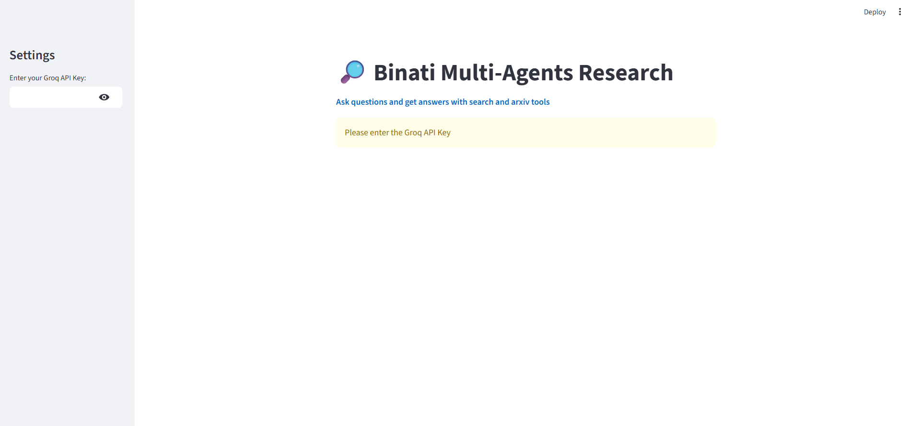
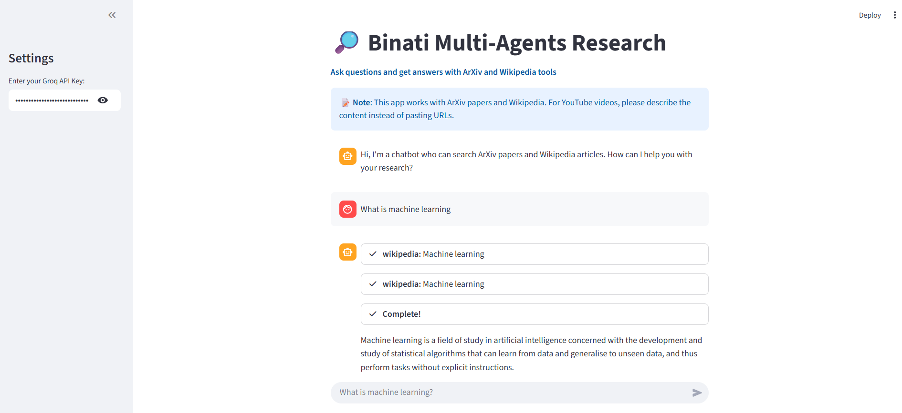
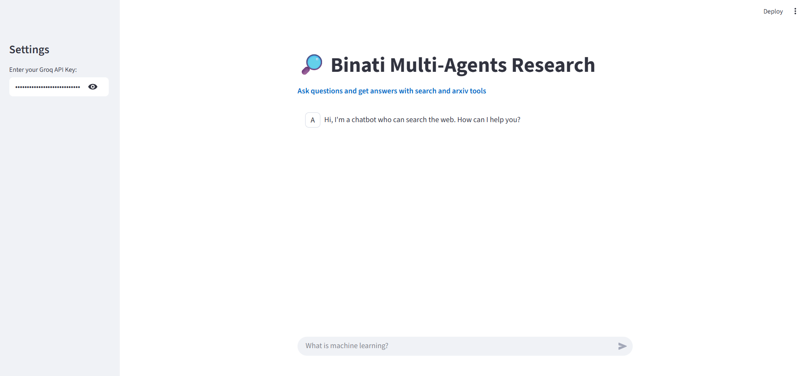
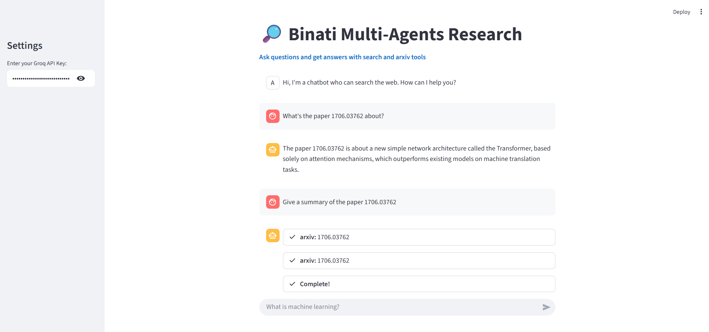

<div align="center">
  <strong>Binati AInalytics</strong>

  # 🔍 Binati Multi-Agents Research

  _By **BINATI AInalytics**_
</div>

An intelligent research chatbot built with Streamlit that leverages multiple data sources to provide comprehensive answers to your questions. The application uses LangChain agents powered by Groq's Llama model to search through ArXiv papers, Wikipedia articles, and the web.

# Demo





## ✨ Features

- **Multi-Source Research**: Searches across ArXiv, Wikipedia, and the web simultaneously
- **Real-time Streaming**: Get responses as they're generated
- **Interactive Chat Interface**: Clean, user-friendly Streamlit interface
- **Agent Transparency**: View the agent's thought process and actions
- **Powered by Groq**: Fast inference using Llama-3.1-8b-instant model

## 🛠️ Technologies Used

- **Streamlit**: Web application framework
- **LangChain**: Agent framework and tool orchestration
- **Groq**: Fast LLM inference
- **ArXiv API**: Academic paper searches
- **Wikipedia API**: Encyclopedia searches  
- **DuckDuckGo**: Web search functionality

## 📋 Prerequisites

- Python 3.7+
- Groq API Key (get one from [Groq Console](https://console.groq.com/))

## 🚀 Installation

1. **Clone the repository**:
   ```bash
   git clone <repository-url>
   cd binati-multi-agents-research
   ```

2. **Install dependencies**:
   ```bash
   pip install -r requirements.txt
   ```

3. **Set up environment variables** (optional):
   Create a `.env` file in the root directory:
   ```env
   GROQ_API_KEY=your_groq_api_key_here
   ```


## 🎯 Usage

1. **Start the application**:
   ```bash
   streamlit run app.py
   ```

2. **Access the web interface**:
   Open your browser and go to `http://localhost:8501`

3. **Enter your Groq API Key**:
   - In the sidebar, paste your Groq API key
   - The key is stored securely in your session

4. **Start asking questions**:
   - Type your research question in the chat input
   - Watch as the agent searches multiple sources
   - Get comprehensive, well-sourced answers

## 💡 Example Queries

- "What is machine learning?"
- "Latest research on quantum computing"
- "Explain the theory of relativity"
- "Recent developments in artificial intelligence"
- "Climate change impacts on biodiversity"

## 🔧 Configuration

### Model Settings
The application uses `llama-3.1-8b-instant` by default. You can modify the model in `app.py`:

```python
llm = ChatGroq(groq_api_key=api_key, model_name="llama-3.1-8b-instant", streaming=True)
```

### Available Tools
The agent has access to three research tools:
- **ArXiv**: Academic papers and preprints
- **Wikipedia**: General knowledge articles
- **DuckDuckGo**: Web search results

## 🏗️ Project Structure

```
binati-multi-agents-research/
├── app.py                 # Main Streamlit application
├── requirements.txt       # Python dependencies
├── .env                   # Environment variables (optional)
└── README.md             # Project documentation
```

## 🔐 Security Notes

- API keys are handled securely through Streamlit's session state
- Keys are not logged or stored permanently
- Use environment variables for production deployments

## 🤝 Contributing

1. Fork the repository
2. Create a feature branch (`git checkout -b feature/amazing-feature`)
3. Commit your changes (`git commit -m 'Add amazing feature'`)
4. Push to the branch (`git push origin feature/amazing-feature`)
5. Open a Pull Request

## 📄 License

This project is licensed under the MIT License - see the [LICENSE](LICENSE) file for details.

## 🆘 Troubleshooting

### Common Issues

**"Please enter the Groq API Key" warning**:
- Make sure you've entered a valid API key in the sidebar
- Check that your API key has sufficient credits

**Agent parsing errors**:
- The application handles parsing errors automatically
- If issues persist, try rephrasing your question

**Slow responses**:
- This is normal for complex queries that require multiple tool calls
- The streaming feature shows progress in real-time

## 📞 Support

For questions or issues:
- Open an issue on GitHub
- Check the [LangChain documentation](https://python.langchain.com/docs/get_started/introduction)
- Review [Streamlit documentation](https://docs.streamlit.io/)

## 🙏 Acknowledgments

- [Groq](https://groq.com/) for fast LLM inference
- [LangChain](https://langchain.com/) for agent framework
- [Streamlit](https://streamlit.io/) for the web framework
- ArXiv, Wikipedia, and DuckDuckGo for data sources
